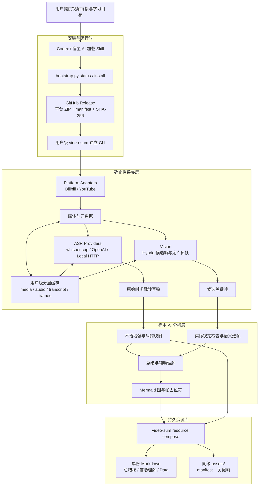

# Bilibili Learning Helper

[English](README_EN.md) | 中文

一个由 Skill 驱动的本地视频学习资料入库工具。CLI 只提供确定性的操作原语，
宿主 AI 负责理解意图、增强转写稿、选择关键帧、生成总结与 Mermaid 图。

## 核心链路

```text
视频链接
  → video-sum capture
  → 原始转写稿 + 候选关键帧
  → 宿主 AI / Skill 分析
  → video-sum resource compose
  → 单份 Markdown 笔记 + 同级 assets/
```

## 项目架构



Skill 和宿主 AI 负责任务理解与内容判断；CLI 负责下载、转写、抽帧、缓存和
原子写入等可重复操作。缓存只保存可再生的中间产物，最终资源库只保留可搬移
的单笔记与同级 `assets/`。

支持 Bilibili 与 YouTube、中文/英文/日文转写、用户级分层缓存，以及三种
ASR 方式：

- `whisper-cpp`：直接调用本机 `whisper-cli`，模型不随项目打包。
- `openai`：调用 OpenAI 音频转写 API，客户端已包含在发布包中。
- `local`：调用用户自行提供的兼容 HTTP 转写端点。

## Skill 安装

日常使用无需克隆仓库、uv、虚拟环境或手动安装 Python 依赖。Skill 的
bootstrap 脚本使用宿主自带的 Python 识别当前平台并下载固定版本的
GitHub Release；安装后的 CLI 不依赖宿主 Python：

```bash
python3 skill/scripts/bootstrap.py status
python3 skill/scripts/bootstrap.py install
# 审核输出中的版本、URL、SHA-256 和目标路径后：
python3 skill/scripts/bootstrap.py install --apply
```

发布包按平台提供统一结构：

```text
video-sum-<version>-<platform>-<arch>.zip
├── video-sum[.exe]
└── manifest.json
```

其中包含 Python 运行时、全部 Python 依赖、yt-dlp、OpenAI ASR 客户端和
FFmpeg。Whisper 模型和 `whisper-cli` 不随包发布；选择本地 whisper.cpp
转写时再单独安装。

Skill 会下载同名 `.sha256` 文件完成校验，再原子安装到用户级 bin 目录。
后续始终使用 `bootstrap.py status` 返回的绝对 `command`。

安装 CLI 后先生成首次配置计划：

```bash
python3 skill/scripts/bootstrap.py onboard \
  --scope project \
  --library-dir "/绝对路径/video-notes" \
  --cache-dir "/绝对路径/video-cache" \
  --asr-provider whisper-cpp \
  --asr-profile balanced
# 审核配置文件、目录和运行时探针后：
python3 skill/scripts/bootstrap.py onboard ... --apply
python3 skill/scripts/bootstrap.py onboard status
```

`onboard` 默认只输出无副作用计划；`--apply` 才创建目录和原子写入配置。
已有不同值不会被覆盖，除非显式使用 `--update`。用户级配置写入系统配置
目录下的 `video-sum/config.env`，项目级配置写入当前项目 `.env`。
状态输出会标明每个有效值的来源，并只报告凭据是否存在，不回显秘密。
项目目前没有发布 CUDA 专用 whisper.cpp 产物；硬件探针只提供保守建议，
不会生成虚构下载地址或把 GPU 硬件存在误报成后端已经加载。

## 使用

先采集原生材料：

```bash
video-sum capture \
  "【分享标题】 https://www.bilibili.com/video/BVxxxxx/" \
  --asr-profile balanced \
  --frame-mode hybrid \
  --cache reuse \
  --frames 10
```

`fast`、`balanced`、`accurate` 分别映射到本地 whisper.cpp 模型档位。使用
`video-sum asr profiles` 查看模型位置与可用状态。

宿主 AI 根据 Skill 处理 capture 产物后，通过下面的原语写入最终笔记：

```bash
video-sum resource compose "<resource_id>" \
  --summary-file summary.md \
  --understanding-file understanding.md \
  --corrected-transcript-file corrected-transcript.md \
  --corrections-file corrections.json
```

每条资源只产生一份 Markdown 笔记，一级标题固定为：

```markdown
# 总结稿
# 辅助理解
# Data
```

图片统一放在笔记同目录的 `assets/` 中，不创建视频专属目录。`# Data`
保存原始/增强转写稿、术语修正信息与关键帧索引。

## CLI 原语

```bash
video-sum doctor
video-sum capture "<URL>"
video-sum resource compose "<resource_id>" ...
video-sum library list|show|search
video-sum cache dir|status|list|inspect|prune|clear
video-sum frames extract "<video-file>" --at 12:30 --around 2
video-sum asr profiles
```

`capture --cache reuse|refresh|off` 分别表示复用缓存、强制刷新与绕过缓存。
下载、音频、转写稿和候选帧存放在操作系统用户缓存目录；Whisper 模型存放
在用户数据目录；最终资源库由用户指定。

## 保存目录与环境变量

```dotenv
VIDEO_SUM_LIBRARY_DIR=/Users/you/Documents/video-notes
VIDEO_SUM_CACHE_DIR=/Users/you/Library/Caches/video-sum
VIDEO_SUM_MODEL_DIR=/Users/you/Library/Application Support/video-sum/models
VIDEO_SUM_DEFAULT_LANGUAGE=zh
VIDEO_SUM_DEFAULT_FRAMES=10
VIDEO_SUM_DEFAULT_FRAME_MODE=hybrid
VIDEO_SUM_DEFAULT_CACHE_POLICY=reuse
```

路径和默认项优先级为：CLI 参数 > 环境变量 > 项目 `.env` > 用户
`config.env` > 操作系统/内置默认值。
缓存 manifest 只保存稳定 cache key，入选帧会复制到 `assets/`，因此笔记
可以整体搬移。

## Skill 包

```text
skill/
├── SKILL.md
├── agents/
│   └── openai.yaml
├── references/
│   └── environment-recovery.md
└── scripts/
    └── bootstrap.py
```

`bootstrap.py status` 检查发布包；`bootstrap.py install` 生成固定版本的
下载计划，加 `--apply` 才下载、校验并安装。Skill 不再通过源码仓库或包
管理器恢复 CLI。

## 开发

```bash
git clone https://github.com/l4place0/bilibili-learning-helper.git
cd bilibili-learning-helper
uv sync --extra dev
uv run ruff check .
uv run pytest
uv sync --extra standalone
uv run python scripts/build_standalone.py \
  --target darwin-arm64 --version 0.2.0
```

推送匹配 `v*` 的 tag 会触发
[release.yml](.github/workflows/release.yml)，测试五个平台并将 bundle 与
SHA-256 sidecar 发布到 GitHub Release。

更详细的边界说明见 [docs/ARCHITECTURE.md](docs/ARCHITECTURE.md)。

## License

MIT
